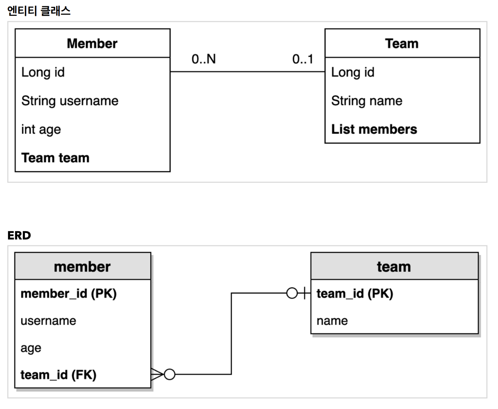

# querydsl
[실전! Querydsl] JPA

### [수강일정]
2022.08.05 ~ 진행중 
   
### [수강일지]
| | | |
|-|-|-|
|Name|Status|수강일|
|Querydsl 소개|-|-|
|1) 소개|수강완료|2022/08/05|
|2) 강의자료|수강완료|2022/08/05|
|프로젝트 환경설정|-|-|
|프로젝트 생성|수강완료|2022/08/06|
|Querydsl 설정과 검증|수강완료|2022/08/06|
|라이브러리 살펴보기|수강완료|2022/08/06|
|H2 데이터베이스 설치|수강완료|2022/08/06|
|스프링 부트 설정 - JPA, DB|수강완료|2022/08/06|
|예제 도메인 모델|-|-|
|예제 도메인 모델과 동작확인|수강완료|2022/08/06|
|기본 문법|-|-|
|시작 - JPQL vs Querydsl|수강완료|2022/08/07|
|기본 Q-Type 활용|수강완료|2022/08/07|
|검색 조건 쿼리|수강완료|2022/08/07|
|결과 조회|수강완료|2022/08/07|
|정렬|수강완료|2022/08/07|
|페이징|수강완료|2022/08/07|
|집합|수강완료|2022/08/07|
|조인 - 기본 조인|수강완료|2022/08/07|
|조인 - on절|수강완료|2022/08/07|
|조인 - 페치 조인|수강완료|2022/08/07|
|서브 쿼리|수강완료|2022/08/07|
|Case 문|수강완료|2022/08/07|
|상수, 문자 더하기|수강완료|2022/08/07|
|중급 문법|-|-|
|프로젝션|수강완료|2022/08/08|
|프로젝션과 결과 반환 - DTO 조회|수강완료|2022/08/08|
|프로젝션과 결과 반환 - @QueryProjection|수강완료|2022/08/08|
|동적 쿼리 - BooleanBuilder 사용|수강완료|2022/08/08|
|동적 쿼리 - Where 다중 파라미터 사용|수강완료|2022/08/08|
|수정, 삭제 벌크 연산|수강완료|2022/08/08|
|SQL function 호출하기|수강완료|2022/08/08|
|실무 활용 - 순수 JPA와 Querydsl|-|-|
|순수 JPA 리포지토리와 Querydsl|수강완료|2022/08/09|

### [Project ERD]

