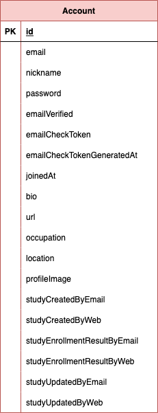

## StudyOlle_redo
- 강의로 배운 내용을 바탕으로 혼자 직접 구현해보기

#### 환경구성
1) SpringBoot  
2) Java11  
3) Maven  
4) JPA  
5) SpringSecurity  
6) Junit Test  
7) Mysql  
8) Postgresql  
9) ModelMapper  
10) thymeleaf  

### ERD
