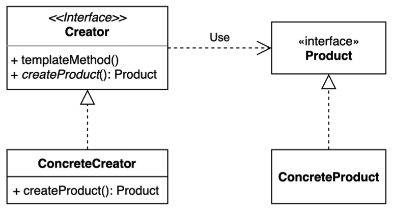

#### 팩토리 메서드 (Factory method) 패턴
- 구체적으로 어떤 인스턴스를 만들지는 서브 클래스가 정한다.
- 다양한 구현체(Product)가 있고, 그중에서 특정한 구현체를 만들 수 있는 다양한 팩토리(Creator)를 제공할 수 있다.
     

(1) 팩토리 메서드 적용 전
`Client.java`
```java
public class Client {
    public static void main(String[] args) {
        Ship whiteship = ShipFactory.orderShip("Whiteship", "keesun@mail.com");
        System.out.println(whiteship);

        Ship blackship = ShipFactory.orderShip("Blackship", "keesun@mail.com");
        System.out.println(blackship);
    }
}
```

`Ship.java`
```java
import lombok.Getter;
import lombok.Setter;
import lombok.ToString;

@Getter
@Setter
@ToString
public class Ship {
    private String name;
    private String color;
    private String logo;
}
```

`ShipFactory.java`
```java
public class ShipFactory {
    /**
     * 로직이 한곳에 다 모여있다.
     * name 한개가 추가되면.. 변경 코드가 너무 많음
     * 배의 특성이 추가되면 Ship 클래스가 바뀌고 변경 코드가 너무 많아진다.
     * @param name
     * @param email
     * @return
     */
    public static Ship orderShip(String name, String email) {
        // validate
        if (name == null || name.isBlank()) {
            throw new IllegalArgumentException("배 이름을 지어주세요.");
        }
        if (email == null || email.isBlank()) {
            throw new IllegalArgumentException("연락처를 남겨주세요.");
        }

        prepareFor(name);

        Ship ship = new Ship();
        ship.setName(name);

        // Customizing for specific name
        if (name.equalsIgnoreCase("whiteship")) {
            ship.setLogo("\uD83D\uDEE5️");
        } else if (name.equalsIgnoreCase("blackship")) {
            ship.setLogo("⚓");
        }

        // coloring
        if (name.equalsIgnoreCase("whiteship")) {
            ship.setColor("whiteship");
        } else if (name.equalsIgnoreCase("blackship")) {
            ship.setColor("black");
        }

        // notify
        sendEmailTo(email, ship);

        return ship;
    }

    private static void prepareFor(String name) {
        System.out.println(name + " 만들 준비 중");
    }

    private static void sendEmailTo(String email, Ship ship) {
        System.out.println(ship.getName() + " 다 만들었습니다.");
    }

}
```
(2) 팩토리 메서드 적용 후
\
`ShipFactory.java`
```java
public interface ShipFactory {
    // orderShip
    default Ship orderShip(String name, String email) {
        // 어떤일이 일어나는지 default 로 정의해보자.
        validate(name, email);

        prepareFor(name);

        // 하위클래스에 위임
        Ship ship = createShip();

        // notify
        sendEmailTo(email, ship);

        return ship;
    }

    /**
     * 추상메서드
     * 하위클래스가 정의해야하는 메서드
     * @return
     */
    Ship createShip();

    // java9 부터 인터페이스에 private 메서드 사용 가능
    private void validate(String name, String email) {
        if (name == null || name.isBlank()) {
            throw new IllegalArgumentException("배 이름을 지어주세요.");
        }
        if (email == null || email.isBlank()) {
            throw new IllegalArgumentException("연락처를 남겨주세요.");
        }
    }

    private void prepareFor(String name) {
        System.out.println(name + " 만들 준비 중");
    }

    private void sendEmailTo(String email, Ship ship) {
        System.out.println(ship.getName() + " 다 만들었습니다.");
    }
}
```

`Ship.java`
```java
import lombok.Getter;
import lombok.Setter;
import lombok.ToString;

@Getter
@Setter
@ToString
public class Ship {
    private String name;
    private String color;
    private String logo;
}
```

`BlackShip.java`
```java
public class Blackship extends Ship {
    public Blackship() {
        setName("blackship");
        setLogo("⚓");
        setColor("black");
    }
}
```

`BlackShipFactory.java`
```java
public class BlackshipFactory implements ShipFactory {
    @Override
    public Ship createShip() {
        return new Blackship();
    }
}
```

`WhiteShip.java`
```java
public class Whiteship extends Ship {
    public Whiteship() {
        setName("whiteship");
        setLogo("\uD83D\uDEE5");
        setColor("white");
    }
}
```

`WhiteShipFactory.java`
```java
public class WhiteshipFactory implements ShipFactory {
    @Override
    public Ship createShip() {
        return new Whiteship();
    }
}
```

`Client.java`
```java
public class Client {
    public static void main(String[] args) {
        Client client = new Client();
        client.print(new WhiteshipFactory(), "whiteship", "keesun@mail.com");
        client.print(new BlackshipFactory(), "blackship", "keesun@mail.com");
    }

    private void print(ShipFactory shipFactory, String name, String email) {
        System.out.println(shipFactory.orderShip(name, email));
    }
}
```