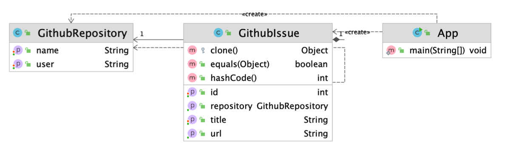

#### 프로토타입 (Prototype) 패턴
- 기존 인스턴스를 복제하여 새로운 인스턴스를 만드는 방법
- 복제 기능을 갖추고 있는 기존 인스턴스를 프로토타입으로 사용해 새 인스턴스를 만들 수 있다.
     

(1) 적용 후


```GithubIssue.java```
```java
import lombok.Getter;
import lombok.Setter;

import java.util.Objects;

public class GithubIssue {

    @Getter
    @Setter
    private int id;

    @Getter
    @Setter
    private String title;

    @Getter
    private GithubRepository repository;

    public GithubIssue(GithubRepository repository) {
        this.repository = repository;
    }

    public String getUrl() {
        return String.format("https://github.com/%s/%s/issues/%d",
                repository.getUser(),
                repository.getName(),
                this.getId());
    }

    /**
     * 오버라이딩
     * @return
     * @throws CloneNotSupportedException
     */
    @Override
    protected Object clone() throws CloneNotSupportedException {
        // Object 의 clone 사용해도 된다. (shallow copy)
        // return super.clone();

        // deep copy 로 변경하자.
        // 직접 커스터마이징 해도된다.
        GithubRepository repository = new GithubRepository();
        repository.setUser(this.repository.getUser());
        repository.setName(this.repository.getName());

        GithubIssue githubIssue = new GithubIssue(repository);
        githubIssue.setId(this.id);
        githubIssue.setTitle(this.title);

        return githubIssue;
    }

    @Override
    public boolean equals(Object o) {
        if (this == o) return true;
        if (o == null || getClass() != o.getClass()) return false;
        GithubIssue that = (GithubIssue) o;
        return id == that.id && Objects.equals(title, that.title) && Objects.equals(repository, that.repository);
    }

    @Override
    public int hashCode() {
        return Objects.hash(id, title, repository);
    }
}
```